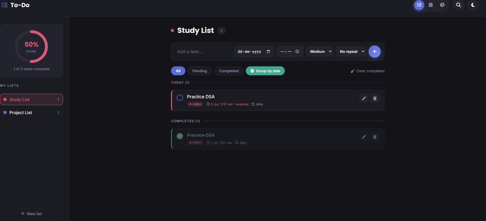

# SCT_WD_4 — To-Do Web Application

Web Development Internship (Task 04) — a fully-featured, multi-list to-do web app with calendar and analytics views

A feature-rich, dark-themed to-do web application built from scratch with HTML5, CSS3, and Vanilla JavaScript — no frameworks, no libraries. Organize tasks across multiple lists, track them on a calendar, and visualize your productivity.

**Project:** Web Development Internship — Task 04

🌐 **Live Demo:** https://radhika200gupta-tech.github.io/SCT_WD_4/

## 📸 Project Preview



## 🚀 Features

- **Multiple custom lists** — create as many task lists as you need, each with its own color picked from a custom hue/saturation color wheel
- **Full task management** — add, edit, complete, and delete tasks with title, due date, due time, priority, and repeat frequency
- **Recurring tasks** — tasks set to repeat daily, weekly, or monthly automatically regenerate once completed
- **Three views:**
  - **Tasks** — filterable list (All / Pending / Completed), with an optional "group by date" mode
  - **Calendar** — a full month view showing which days have tasks, with a day-detail panel
  - **Analytics** — summary stats, a donut chart of tasks by list, and a bar chart of completions over the last 7 days
- **Global search** — instantly search tasks across every list from one panel
- **Progress ring** — a live-updating circular progress indicator for the active list
- **Dark theme with light-mode support** — polished styling for both
- **Fully responsive** — collapsible sidebar and adaptive layout for mobile
- **Persistent state** — all lists, tasks, and settings are saved via `localStorage`

## 📁 Folder Structure

```
SCT_WD_4/
├── index.html      # Markup and structure
├── style.css       # Styling, theming, and animations
├── script.js       # App logic — state, rendering, calendar, analytics
├── todo.png        # Project preview screenshot
└── README.md       # Project documentation
```

Three files, no build tools, no dependencies.

## 🧩 Sections Included

- Top bar (menu toggle, title, view switcher, search, theme toggle)
- Search panel (cross-list task search)
- Sidebar (progress ring, list of custom lists, add-list button)
- Tasks view (add-task form, filters, task cards)
- Calendar view (month grid, day-detail panel)
- Analytics view (summary cards, donut chart, bar chart)
- Edit-task modal and create/edit-list modal with color wheel picker

## 🎨 Design Tokens

| Token | Value |
|---|---|
| Background | `#131318` |
| Panel | `#1b1c22` |
| Accent | `#5b6bd6` |
| Teal | `#3fa88f` |
| Danger | `#d1616f` |
| Text | `#efeef4` |
| Font (display) | Poppins (Google Fonts) |
| Font (body) | Inter (Google Fonts) |
| Font (mono) | JetBrains Mono (Google Fonts) |
| Icons | Font Awesome 6 |

## 🛠️ Tech Stack

- **HTML5** — semantic markup
- **CSS3** — custom properties, Grid & Flexbox, no framework
- **Vanilla JavaScript (ES6+)** — no libraries, custom-built calendar, charts, and color-wheel picker
- **Font Awesome** — icon library (via CDN)
- **Google Fonts** — Poppins, Inter & JetBrains Mono (via CDN)

## ▶️ How to Run

No build tools or dependencies required.

1. Download or clone this repo
2. Keep `index.html`, `style.css`, and `script.js` in the same folder
3. Open `index.html` directly in your browser

> Note: Font Awesome icons and Google Fonts load via network requests, so an internet connection is needed for the page to look correct.

## 📌 Notes

- All data (lists, tasks, theme, view preference) is stored locally in the browser via `localStorage` — no backend or account required.
- The donut and bar charts in the Analytics view are rendered as inline SVG, generated dynamically from task data.
- Accessibility basics included: `aria-live` regions for status updates, keyboard-focusable controls, and `prefers-reduced-motion` support.

## 👤 Author

**Radhika Gupta**
Frontend Developer | Web Development Enthusiast

Built as part of my Web Development Internship (Task 04) at SkillCraft Technology.
